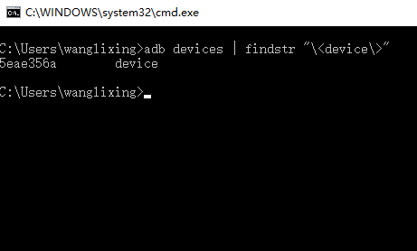

起源于手机调试时安卓对接同事打印log日志的需求，现在把手机adb调试的摸索之旅总结下，方便他人
<!-- more -->
<!-- excerpt -->
## 概念介绍
　　ADB的全称为Android Debug Bridge，字面意思就是安卓调试桥接，简单点说，它是Android系统提供的一套工具，通过它，我们可以在电脑上建立一个连接到手机的通道，然后可以在电脑上向手机发送一些指令，完成一些我们需要做的工作。ADB也是android sdk里的一个工具，用这个工具可以直接操作管理android模拟器或者真实的andriod设备(如G1手机)。可以去 android sdk/platform-tools or [ADB Kits](http://adbshell.com/downloads)进行下载。
有关adb shell的文档在 [这里](http://adbshell.com/)
主要功能为:
- 运行设备的shell(命令行)
- 管理模拟器或设备的端口映射
- 计算机和设备之间上传/下载文件
- 将本地apk软件安装至模拟器或android设备  *一般测试常用*

本质：ADB是一个客户端-服务器端程序，其中客户端是你用来操作的电脑，服务器端是android设备

## 启动运行
　　基本概念已经有所了解，要通过这个工具来监听手机某个操作下发出的某个链接请求(已知关键字)，需要的命令是`logcat`。需要注意的是，由于这个调试是在PC端进行，一般开发来说用的都是unix类系统，本次用的是windows系统，其实最主要的不同点是在字符过滤的命令上，`unix`类系统用的是`grep`， `windows`下用的是`findstr` 除此外并无太大不同。(清屏也不同 clear | cls)
　　首先是在PC上安装`adbKit`，一共三个文件，解压后放到一个文件夹里，然后移动到C盘，为了方便地使用adb命令，需要把这个包含adb命令行启动的文件路径放到系统PATH里面，这个在`MAC`和`windows`上不同，可以自行百度添加系统环境变量。
下一步就是在需要调试的安卓手机上安装adb驱动，把手机打开USB调试，然后安装[adb手机驱动](http://adbdriver.com/downloads/)下载的手机adb驱动，这一步网上教程诸多，啥？问我如何打开USB调试？ ……根据自己手机自行百度吧，这个这里真写不下，可以参考[百度经验](https://jingyan.baidu.com/article/19020a0a1b5448529d2842f6.html)
　　电脑连接手机的情况下，就可以使用cmd命令行(我用的WIN)打开黑窗口，敲个adb看有啥反应，如果出来`Android Debug Bridge version`的字样，那就说明成功了一半，接下来就是要根据需要，使用adb工具的时候了。

## 查看日志及输出
　　通过查看文档得知，使用`adb logcat | findstr "Market"`来获取带有`Market`字样的日志，这个会根据手机的操作来打印出对应的日志，往往不同应用有不同的字符标识，从而可以定位问题，发现有用信息，那如何把日志定向输出到文件里面呢？
　　我在`windows`上的命令输入为：`adb logcat -v time process > D:/log.txt` 这个是指把设备的日志加上时间和线程id输出到D盘下的log.txt中，如果有实时查看的需求，可以用`logViewPro`这个软件来查看日志，还可以建立过滤和筛选等。

## 调试模式
　　这是属于进阶的一部分内容，刚才介绍的adb打印日志，有时会缺失一部分信息，是为了保护应用的一些信息不能被监听，此时就应该进入相应应用的调试模式，有的是在手机磁盘根目录建立一个特定名称的文件夹，有的是直接有debug的apk包，还有些通过点击软件内版本号等，从而开启软件的调试模式，从而可以打印完整的信息，这个一般需要跟安卓软件对应的开发者来获知，从而可以通过adb的完整日志来更好地排查问题。

在adb工具的基础上 还能方便地进行apk包的安装和文件的操作：

| 命令 | 功能 |
| - | - |
| adb shell ls mnt | 查看所有设备储存设备名 |
| adb remount | 将 system 分区重新挂载为可读写分区 |
| adb push <local> <remote> | 从本地复制文件到设备 |
| adb pull <remote> <local> | 从设备复制文件到本地 |
| adb shell ls | 列出目录下的文件和文件夹 |
| adb shell cd  <folder> | 进入文件夹 |
| adb shell rm [-r] <path/filename> | 删除文件(夹) |
| adb shell cat <file> | 查看文件内容 |
| adb shell mkdir path/foldername | 新建文件夹 |
| adb install <apkfile> | 安装APK |
| adb install -r <apkfile> | 保留数据和缓存文件，重新安装apk |
| adb install -s <apkfile> | 安装apk到sd卡 |
| adb uninstall <package> | 卸载APK |
| adb shell cat <file> | 查看文件内容 |
| adb shell cat /data/misc/wifi/*.conf | 查看wifi密码 |
| adb shell /system/bin/screencap -p /sdcard/screenshot.png | 手机截屏保存到手机 |
