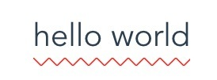

`CSS`是前端工作中最常接触的技术，最近看到有大神整理了`github`上用的一些`CSS`黑魔法，不由得跟着积累一番~
<!-- more -->
<!-- excerpt -->
## 利用css伪类的content属性来输入文本

- 思路来源 鼠标浮动显示文字

```html
<div data-msg="Open this file in Github Desktop">hover</div>
```

```css
div{
    width:100px;
    border:1px solid red;  
    position:relative;
}
div:hover:after{
    content:attr(data-msg);
    position:absolute;
    font-size: 12px;
    width:200%;
    line-height:30px;
    text-align:center;
    left:0;
    top:25px;
    border:1px solid green;
}
```

## 利用伪类实现表单校验的反馈样式

- `:required`伪类指定具有必填项属性的表单
- `:valid`伪类指定一个通过匹配要求的表单元素(结合type使用)
- `:invalid`伪类指定某一未通过匹配要求的元素

```html
<form>
    <div class="form-group">
        <label>name</label>
        <input type="text" required placeholder="请输入名称">
    </div>
    <div class="form-group">
        <label>email</label>
        <input type="email" required placeholder="请输入邮箱">
    </div>
    <div class="form-group">
        <label>homepage</label>
        <input type="url" placeholder="请输入博客url">
    </div>
</form>
```

```scss
.valid {
  border-color: #429032;
  box-shadow: inset 5px 0 0 #429032;
}

.invalid {
  border-color: #D61D1D;
  box-shadow: inset 5px 0 0 #D61D1D;
}

.form-group {
  width: 32rem;
  padding: 1rem;
  border: 1px solid transparent;
  &:hover {
    border-color: #eee;
    transition: border .2s;
  }
  label {
    display: block;
    font-weight: normal;
  }
  input{
    display: block;
    width: 100%;
    line-height: 2rem;
    padding: .5rem .5rem .5rem 1rem;
    border: 1px solid #ccc;
    outline: none;
    &:valid {
      @extend .valid;
    }
    &:invalid {
      @extend .invalid;
    } 
  }
}
```

## nth-of-type选择器
```css
tr: nth-of-type(2n) {
    background-color: red;
}
tr: nth-of-type(2n+1) {
    background-color: green;
}
tr:nth-child(n+5):nth-child(-n+10) {
    /* 选择5-10子元素？ */
}
```

## 实现鼠标悬浮内容自动撑开的过渡动画

> 通过`max-height`来实现transition所需的具体高度来hack实现

```html
<ul>
  <li>
    <div class="hd"> 列表1 </div>
    <div class="bd">列表内容<br>内容列表内容<br>内容列表内容<br>内容</div>
  </li>
  <li>
    <div class="hd"> 列表1 </div>
    <div class="bd">列表内容<br>内容列表内容<br>内容列表内容<br>内容</div>
  </li>
  <li>
    <div class="hd"> 列表1 </div>
    <div class="bd">列表内容<br>内容列表内容<br>内容列表内容<br>内容</div>
  </li>
</ul>
```

```css
.bd {
  max-height:0;
  overflow:hidden;
  transition: all 1s ease-out;
}
li:hover .bd {
  max-height: 600px;
  transition-timing-function: ease-in;
}
```

## `rem`布局不在使用`JavaScript`设置

> 有时候，移动端用`rem`布局时候，根据不同的屏幕宽度要设置不同的`font-size`来做到适配，要写一坨`JS`来设置，能不能不用`JS`呢？(以`750px`设计稿为基准，`font-size`设置为`100px` 只考虑`DRP=2`)
- 原有的`js`实现代码: (```document.querySelector('html').style.fontSize = `${window.innerWidth / 7.5 }px`;```)
- 一行代码的`css`实现: (`html{font-size: calc(100vw / 7.5)}`)

## 利用`transparent`属性实现各种三角形/提示框

> [推荐链接](https://www.cnblogs.com/lhb25/p/css-and-css3-triangle.html)

```css
#triangle-right {
    width: 0;
    height: 0;
    border-top: 50px solid transparent;
    border-left: 100px solid red;
    border-bottom: 50px solid transparent;
}
```
如果项目中遇到，建议做成通用的宏，方便在项目各处调用

## 实现文字的波浪线效果

需求如下图所示：


基本思路：截取'X'的上半部分得到一个'V',再结合`repeat`生成波浪线，下面是scss的mixin(注意linear-gradient的兼容性)

```scss
@mixin waveline($color,$h) {
    position: relative;
    &::after {
        content: '';
        display: block;
        position: absolute;
        top: 100%;
        left: 0;
        width: 100%;
        height: $h;
        background: linear-gradient(135deg, transparent, transparent 45%, $color, transparent 55%, transparent 100%),
                    linear-gradient(45deg, transparent, transparent 45%, $color, transparent 55%, transparent 100%);
        background-size: $h * 2 $h * 2;
    }
}
```

使用效果:


## 一些非常简单的css技术

1. `CSS`实现文字两段对齐(`text-align-last: justify`)
2. `ios`支持弹性滚动(`body{-webkit-overflow-scrolling: touch;}`)
3. 改变`input`光标颜色:
    - 对所有`input`元素添加样式`caret-color: auto;`
    - 特定的`input`元素添加样式`caret-color: red;`
4. 图片黑白效果(`filter: grayscale(100%); -webkit-filter: grayscale(100%); -moz-filter: grayscale(100%); -ms-filter: grayscale(100%); -o-filter: grayscale(100%);`)
5. css奇技淫巧 [github地址](https://github.com/chokcoco/iCSS) [blog地址](http://www.cnblogs.com/coco1s/)
6. CSS radio/checkbox单复选框元素显隐技术[张鑫旭大神博客](http://www.zhangxinxu.com/wordpress/2012/01/css-css3-selector-element-display-tab-listdown/)

PS: *本文是再jawil/blog的文档上缩减总结而成，版权归原作者所有，加入的自己部分仅为学习探讨使用*
