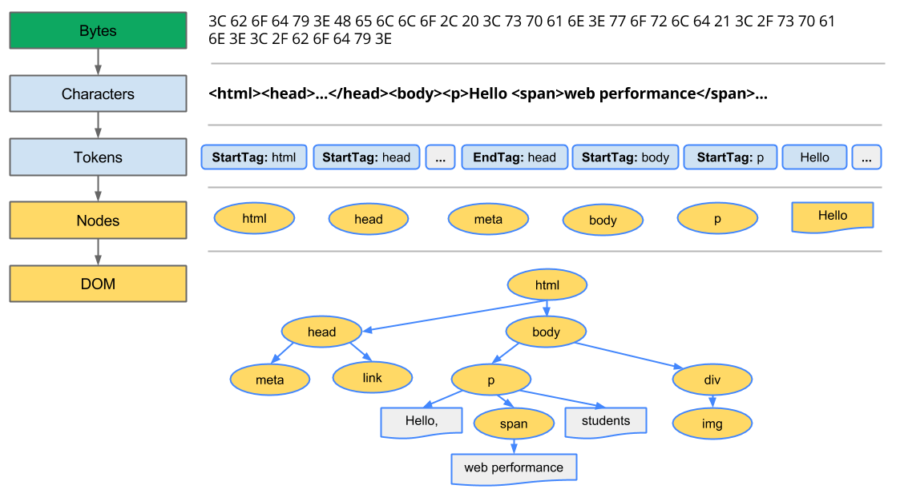
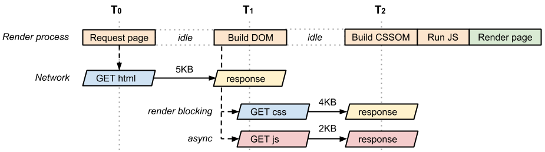

作为前端工程师，浏览器就是最重要的端，如果想要进阶为高级工程师，对浏览器渲染原理的研究是少不了的，让我们一起看下浏览器在渲染一个`html`时具体干了啥，相信看过之后会对页面的理解更加深刻。hoho~
<!-- more -->
<!-- excerpt -->

### 构建对象模型

*浏览器一开始拿到的东西其实是个文本文件，那这个文本文件是如何转换为一张网页的呢？*

浏览器渲染页面前先要构建`DOM`和`CSSOM`树，但这个构建过程并未涉及到渲染，其步骤总结如下：

- 字节 → 字符 → 令牌 → 节点 → 对象模型。
- `HTML`标记转换成文档对象模型(`DOM`)；`CSS`标记转换成`CSS`对象模型(`CSSOM`)。
- `DOM`和`CSSOM`是独立的数据结构。
- `Chrome DevTools Timeline`让我们可以捕获和检查`DOM`和`CSSOM`的构建和处理开销



浏览器每次处理`HTML`标记时，都会完成以上所有步骤：将字节转换成字符，确定令牌，将令牌转换成`dom`节点，然后构建`DOM`树。这整个流程可能需要一些时间才能完成，有大量`HTML`需要处理时更是如此。

在浏览器构建我们这个简单页面的`DOM`时，在文档的`head`部分遇到了一个`link`标记，该标记引用一个外部`CSS`样式表：`style.css`。由于预见到需要利用该资源来渲染页面，它会立即发出对该资源的请求，如果不另外声明，会是阻塞后面渲染的资源请求。


`CSSOM`为何具有树结构？为页面上的任何对象计算最后一组样式时，浏览器都会先从适用于该节点的最通用规则开始（例如，如果该节点是`body`元素的子项，则应用所有`body`样式），然后通过应用更具体的规则（即规则“向下级联”）以递归方式优化计算的样式。不过要记得浏览器有自己的默认样式，因此一开始以此为基础建立`cssom`树，我们平时用reset来覆盖和重新计算样式。

`CSSOM`和`DOM`是独立的数据结构，浏览器将两者关联在一起生成渲染树。

### 关键渲染路径

*渲染树是怎么出现并生成的呢*

整体的渲染过程包括如下四步：

- `DOM`树与`CSSOM`树合并后形成渲染树。
- 渲染树只包含渲染网页所需的节点。
- 布局计算每个对象的精确位置和大小。
- 最后一步是绘制，使用最终渲染树将像素渲染到屏幕上


以上是简单的浏览器的`todo-list`, 那浏览器为了构建渲染树具体做了什么事情呢：
1. 从`DOM`树的根节点开始遍历每个可见节点。
	- 某些节点不可见（例如脚本标记、元标记等），因为它们不会体现在渲染输出中，所以会被忽略。
	- 某些节点通过`CSS`隐藏，因此在渲染树中也会被忽略，例如，上例中的`span`节点---不会出现在渲染树中，因为有一个显式规则在该节点上设置了`display: none`属性。
2. 对于每个可见节点，为其找到适配的`CSSOM`规则并应用它们。
3. 发射可见节点，连同其内容和计算的样式。

最后，既然我们知道了哪些节点可见、它们的计算样式以及几何信息，我们终于可以将这些信息传递给最后一个阶段：将渲染树中的每个节点转换成屏幕上的实际像素。这一步通常称为“绘制”或“栅格化”。

`Layout`(内存中) -> `paint`(绘制出来)

下面简要概述了浏览器完成的步骤：

1. 处理`HTML`标记并构建`DOM`树。
2. 处理`CSS`标记并构建`CSSOM`树。
3. 将`DOM`与`CSSOM`合并成一个渲染树。
4. 根据渲染树来布局，以计算每个节点的几何信息。
5. 将各个节点绘制到屏幕上。

这五个步骤就是关键渲染路径的概念。

### 资源的阻塞

默认情况下，`CSS`被视为阻塞渲染的资源，不过可以通过媒体类型和媒体查询将一些`CSS`资源标记为不阻塞渲染。但无论阻塞还是不阻塞，都会下载所有的`CSS`资源。

当`CSS`未下载完或者未形成`CSSOM`，都不会触发浏览器的渲染树合成的过程，从而阻塞了渲染;请注意“阻塞渲染”仅是指浏览器是否需要暂停网页的首次渲染，直至该资源准备就绪。

`JavaScript`允许我们修改网页的方方面面：内容、样式以及它如何响应用户交互。 不过，`JavaScript`也会阻止`DOM`构建和延缓网页渲染。可以这样理解：`js`可以最大程度的操纵`DOM`和`CSSOM`，浏览器会对这个脚本做最坏的假设，遇到脚本后，脚本的执行优先级会排得比较高，从而阻碍了`DOM`树的继续构建，直到`js`脚本执行完毕。

如果在脚本上用`async`标记为异步，会节省`DOMCONTENTLOADED`的完成时间，并在这之后执行`js`脚本。

对于内联脚本：

- 脚本在文档中的位置很重要，执行我们的内联脚本会阻止`DOM`构建，也就延缓了首次渲染
- 当浏览器遇到一个`script`标记时，`DOM`构建将暂停，直至脚本完成执行。
- `JavaScript`可以查询和修改`DOM`与`CSSOM`。
- `JavaScript`执行将暂停，直到`CSSOM`就绪(因此在一个`style`脚本后跟一个JS脚本，会让前者阻塞`dom`树的构建)
	
对于没加任何标记的异步脚本：

- 浏览器会在第一次读入`html`文本后就去异步拉取脚本，但脚本对`dom`的阻塞情况要根据其位置来决定
- 如果某个脚本拉不下来，会阻止其后面剩余文档的处理过程
- 异步脚本相对于内联脚本增加了异步获取的成本，从而会增加关键渲染路径的延迟
- 如果在`js`脚本中需要动态创建`script`标签以引入新的`js`，则这个标签对应的资源也会马上下载并执行，除非把逻辑推迟到`onload`后，这也是较佳实践。
	
以下是页面加载过程种的各个敏感时间戳示意图：


* `domLoading`：这是整个过程的起始时间戳，浏览器即将开始解析第一批收到的`HTML`文档字节。
* `domInteractive`：表示浏览器完成对所有`HTML`的解析并且`DOM`构建完成的时间点。
* `domContentLoaded`：表示`DOM`准备就绪并且没有样式表阻止`JavaScript`执行的时间点，这意味着现在我们可以构建渲染树了。一般表示`DOM`和`CSS`都准备就绪的时间点
	- 许多`JavaScript`框架都会等待此事件发生后，才开始执行它们自己的逻辑。因此，浏览器会捕获` `EventStart`和`EventEnd`时间戳，让我们能够追踪执行所花费的时间。
	- 如果没有阻塞解析器的`JavaScript`,则`domContentLoaded`将在`domInteractive`后立即触发。
* `domComplete`：顾名思义，所有处理完成，并且网页上的所有资源（图像等）都已下载完毕，也就是说，加载转环已停止旋转。
* `loadEvent`：作为每个网页加载的最后一步，浏览器会触发`onload`事件，以便触发额外的应用逻辑

有一点需要注意的是，图像/视频/声音等资源的加载不会阻止首次渲染，也就是不会阻止`domContentLoaded`, 但会阻止`onload`事件的完成，关键路径一般指前者，但为了用户的良好体验，还是建议首次宣言需要的资源量不要过大，这就是懒加载部分的内容了。

### 异步请求的加入

接下来探讨以下网络环境对关键渲染路径的影响，在之前的基础上考虑服务器的响应时间和传输时间：

```html
<!DOCTYPE html>
<html>
  <head>
    <meta name="viewport" content="width=device-width,initial-scale=1">
    <link href="style.css" rel="stylesheet">
  </head>
  <body>
    <p>Hello <span>web performance</span> students!</p>
    <div></div>
    <script src="app.js"></script>
  </body>
</html>
```
我们把所有的`CSS`和`JS`都变成页面的外联性的阻塞资源，需要从网络上获取，流程如下


这个图需要仔细研究，如果没有`css`和`js`，那获取到`html`文档后就直接开始构建`dom`树，一般这个速度就会很快，这种情况下关键路径只有`html`文档获取这一个因素，是最优解，理论上把所有资源都设为不阻塞渲染就可以达到这要那个效果。

在获取到`html`文档后，如果有外部脚本，会发现在一个较早时间就去拉取相关资源，此时注意`CSS`的文件拉取阻碍的是渲染，而`JS`资源直接阻碍文档解析，后者的block级别是更高的，也就是把`js`及时变成内联，也不会优化整个加载过程。

关注T2这一步中的`Build CSSOM -> Run JS ->build DOM`是按照`html`中的标签先后顺序来渲染的，因为`CSS`的`link`标签位于`header`中，因此拉取到`js`后也要等`cssom`建立完毕才会执行`js`，只有`js`执行完后才能继续构建`DOM`树，此时有着2次或者更多的最短关键路径长度。(实际项目中，`js`脚本中或许会有更多的请求，从而连续阻塞渲染)

如果我们把脚本声明为异步`async`，`async`和`defer`的区别是前者不保证`js`的执行顺序，但都不会阻碍`dom`解析。异步脚本不保证跟`DomContentLoaded`发生的先后顺序，但一定在`onload`前完成。此时整个`html`文件内容如下:

```html
<!DOCTYPE html>
<html>
  <head>
    <meta name="viewport" content="width=device-width,initial-scale=1">
    <link href="style.css" rel="stylesheet">
  </head>
  <body>
    <p>Hello <span>web performance</span> students!</p>
    <div></div>
    <script src="app.js" async></script>
  </body>
</html>
```



此时脚本不再阻塞解析器，已不算是关键渲染路径的一部分，此时可以发现`CSSOM`不会阻止`DOM`树的构建，使得`domContentLoaded`事件提前执行，最短关键路径长度变为两次往返。上图中有个不严谨之处是`Run JS`和`Render page`的顺序，这两个并不会有明显的现后顺序。

同理，如果把样式也设为非阻塞的资源，那`build DOM`之后便可立即渲染页面。 

### 关键路径优化总结

*要以最快速度完成首次渲染，需要最大限度减少网页上关键资源的数量并（尽可能）消除这些资源，最大限度减少下载的关键字节数，以及优化关键路径长度。*

针对`Javascript`的优化方法:

- 优先选择使用`async/defer`的异步资源，不阻碍首次渲染
- 任何非必须的脚本都要尽量延迟执行
- 避免长时间运行阻碍性质的`js`代码(尤其是定时器)
- 优先把`js`脚本放在`body`标签内的底部，从而尽快解析文本内容

针对`CSS`的优化方法:

- 将`CSS`置于文档的Head标签内 从而尽早发出网络请求
- 避免使用`CSS import`从而控制关键路径中的往返次数
- 将重要的`CSS`样式尽量进行内联处理，尽快进入到页面渲染步骤。


本文基本参考的是[谷歌的web基础知识](https://developers.google.com/web/fundamentals/performance/critical-rendering-path/)，也作为自己的一份读书笔记。