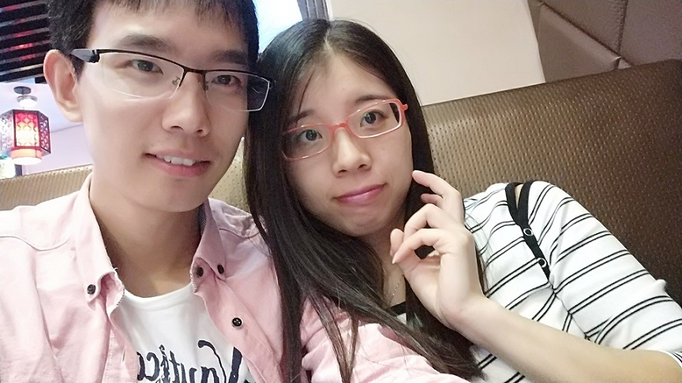
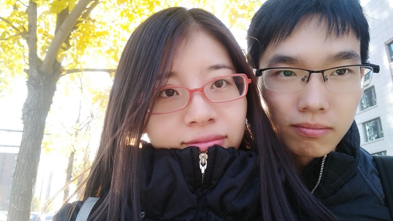

想念只让自己苦了自己，爱上你是我情非得已~~
<!-- more -->
<!-- excerpt -->
## 周年寄语

　　亲爱的，蓦然回首，我们在一起已经一周年啦，犹记一年多前的第一次约会去新奥商场，你帮我选的那条围巾，给我暖暧的感觉；去小吊梨汤约会时，你清秀的脸庞和优雅的气质在我的心里激起的阵阵波澜；以此为序章，后来我们的足迹遍布了北京的各大广场和公园，因为你，我的周末变得丰富多彩，我的生活变得五彩缤纷起来。有了你，所有的情歌都有了意义～

　　过去的一年里，我们一起去了大连，去了我的母校，去看了大海，在沙滩上写下了我们的名字，光着脚在海边行走，让大海见证了我们的欢声笑语。十一假期一起去了江西，登上九江的庐山，欣赏“天生一个仙人洞，无限风光在险峰”的美景，去婺源参观晒秋人家的风宿，在景德镇感受“瓷都”的风韵，尽管行程匆匆，但我们确实体验了许多，收获了许多美好的画面。在新的一年里，我想实现我们第一次聊微信时提到的去云南丽江的愿望，早做规划，为未来留下更多更美的回忆，期待与你一起去欣赏那世外桃源般的美景。

　　在福建的夜晚，我抬头看到清晰的漫天星辰和浩瀚银河，忽然想起你跟我小时候都看到过这星辰大海，然后就突然想跟你一起看这浩瀚群星，一起去回忆小时候的美好。那个时候，随动身千里外，心已飞回你身边。正是这份无时无刻的思念，才让我回到北京见到你的心愿如此强烈。当你去车站接我的时候，我突然发现有人等你是如此的幸福和美妙。

<embed autostart="true" hidden="true" loop="true" src="http://opm3cm6nh.bkt.clouddn.com/qfdy.mp3"></embed>

　　多谢亲爱的，这一年以来对我的爱、对我的包容、督促和支持，如果没有你，我不可能体验把一个人无时无刻放在心中的感觉，也不会让牵挂和思念这两种感觉填充我的内心，正是你让我心理变得完整，让我懂得爱和付出。人生征途漫漫，正是有你让我不断前行努力，我将祛除性格的怯懦，更勇敢地面对生活中的挑战。未来的一年里，我要祈祷你的实验顺利，论文课题获得进展，永远保持积极的心态面对一切。

—————王利兴

**情人节链接 http://a3.rabbitpre.com/m/zraybMQIv**

