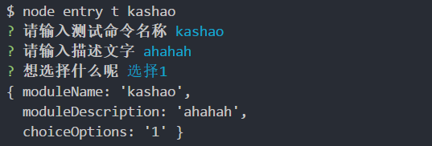

工作中遇到某些上线脚本的交互式自动部署需求，在网上探索了好久发现没有很系统的教程，在这里总结一下探索的过程，方便后面有需要时查阅。
<!-- more -->
<!-- excerpt -->

`NODE`开发命令行工具的网上资料相对零散，尝试用一个完整的[仓库](https://github.com/wlx200510/node_cli)来介绍`Node`可视化命令行的完整开发流程

参考链接：

- [Node交互式命令行工具开发](https://cnodejs.org/topic/57de52197e77820e3acfdfd2)
- [跟着老司机玩转 Node 命令行](https://juejin.im/entry/57aaffba2e958a0066cb5832)

先介绍下本次教程需要用到的工具：

- 用于处理命令行工具的包 [commander](https://github.com/tj/commander.js)
- 用于美化命令行颜色的包 [chalk](https://github.com/chalk/chalk)
- 命令行交互功能的工具 [inquirer](https://github.com/SBoudrias/Inquirer.js)
- 调用系统命令的工具(包装了`child_process`) [shelljs](https://github.com/shelljs/shelljs)
- `Node`环境下的ssh模块工具 [node-ssh](https://github.com/steelbrain/node-ssh)
- `ora`命令行的loading效果 [ora](https://github.com/sindresorhus/ora)

### 开发准备

先是通过`npm init -y`快速建立仓库模板，安装刚才提到的六个依赖

介绍尝试两个核心模块的入门写法：

```javascript
// entry.js
const program = require('commander')
const inquirer = require('commander')

program
  .command('module')
  .alias('m')
  .description('创建新的模块')
  .option('-n --name [moduleName]', '模块名称')
  .action(option => {
    console.log('Hello World', option.name)
  })

program.parse(process.argv)
```

执行一下代码看效果：
`node entry m -n haha`

如果不想每次都进到仓库下面才能执行，就要按照以下步骤对执行命令环境进行配置

- 在`package.json`中配置`bin`字段，用一个`key`来关联到入口js文件
- 注册全局命令`npm link`，将`key`代表的路径加入环境变量`PATH`中
- 在入口文件最上方加上`shenbang`, #! /usr/bin/env node 表示是可执行应用
- 接下来就可以任意地方直接`entry m -n haha`啦，吼吼

简单介绍下刚才用到的`commander API`:

- `command` 定义命令行指令, 后面可以跟上一个`name`，用空格隔开 `.command('module [moduleName]')`
- `alias` 定义一个更短的命令行指令, 是上一项的别名
- `description` 描述，它会在`help`里面展示
- `option` 定义参数。它接受四个参数，在第一个参数中，它可输入短名字 -a和长名字–app ,使用 | 或者,分隔，在命令行里使用时，这两个是等价的，区别是后者可以在程序里通过回调获取到；第二个为描述, 会在 help 信息里展示出来；第三个参数为回调函数，他接收的参数为一个string，有时候我们需要一个命令行创建多个模块，就需要一个回调来处理；第四个参数为默认值
- `action` 注册一个`callback`函数
- `parse` 解析命令行
- `on` 监听某条命令输入后，用第二个参数(函数)来指定自定义动作

### 引入inquirer进行界面交互

这个工具主要是在命令行中为用户提供界面和查询会话流程，其基本语法为：

```javascript
var inquirer = require('inquirer')
inquirer.prompt([]).then(function (answers) {
  // ...
})
```

包含的功能点：

- `input–`输入
- `validate`–验证
- `list`–列表选项
- `confirm`–提示
- `checkbox`–复选框等等

示例代码：

```javascript
const program = require('commander')
const inquirer = require('inquirer')
const chalk = require('chalk')
program
    .command('test')
    .alias('t')
    .description('创建新的测试命令')
    .option('--name [moduleName]')
    .option('--opt1', '启用第一个')
    .option('--opt2', '启用第二个')
    .action(option => {
        var config = Object.assign({
            moduleName: null,
            description: '',
            opt1: false,
            opt2: false
        }, option)
        var promps = []
        console.log(chalk.red('开启前端工程化之路'))
        if(config.moduleName !== 'string') {
              promps.push({
                type: 'input',
                name: 'moduleName',
                message: '请输入测试命令名称',
                validate: function (input){
                    if(!input) {
                        return '不能为空'
                    }
                    return true
                }
              })
        }
        if(config.description !== 'string') {
            promps.push({
              type: 'input',
              name: 'moduleDescription',
              message: '请输入描述文字'
            })
        }
        if(config.opt1 === false && config.opt2 === false) {
          promps.push({
            type: 'list',
            name: 'choiceOptions',
            message: '想选择什么呢',
            choices: [
              {
                name: '选择1',
                value: '1'
              },
              {
                name: '选择2',
                value: '2'
              },
              {
                name: '其他',
                value: 'other'
              }
            ]
          })
        }
        inquirer.prompt(promps).then(function (answers) {
          console.log(answers)
        })
    })
    .on('--help', function() {
      console.log('  Examples:')
      console.log('')
      console.log(chalk.bgBlue('entry t moduleName'))
      console.log('$ entry t moduleName')
    })
    program.parse(process.argv)
```



之所以选择`chalk`来进行命令行控制是因为轻量且API友好，也是作者早期接触的输出美化工具之一，实在是爱不释手。

### 其余工具简介

`shelljs`和`node-ssh`两个模块是根据每个人的自动化需求来编写的，前者是在你用`shell`很熟练的基础上来用的，其本质是更好更方便地调用系统级别的命令，后者是`ssh`自动登录脚本的编写，适用于自动登录到跳板机服务器来执行某些`shell`脚本等自动化的情况。

```js
// shelljs使用方法举例
var shell = require('shelljs');

if (!shell.which('git')) {
  shell.echo('Sorry, this script requires git');
  shell.exit(1);
}

// Copy files to release dir
shell.rm('-rf', 'out/Release');
shell.cp('-R', 'stuff/', 'out/Release');

// Replace macros in each .js file
shell.cd('lib');
shell.ls('*.js').forEach(function (file) {
  shell.sed('-i', 'BUILD_VERSION', 'v0.1.2', file);
  shell.sed('-i', /^.*REMOVE_THIS_LINE.*$/, '', file);
  shell.sed('-i', /.*REPLACE_LINE_WITH_MACRO.*\n/, shell.cat('macro.js'), file);
});
shell.cd('..');

// Run external tool synchronously
if (shell.exec('git commit -am "Auto-commit"').code !== 0) {
  shell.echo('Error: Git commit failed');
  shell.exit(1);
}
```

使用`Node-ssh`的代码示例，其本质就是通过ssh登录机器，然后执行一系列操作，包括文件传输，跳板机器上的命令执行等等，都是一些流水流程，示例代码用的`Promise`，可以改造成`async await`:

```javascript
var path, node_ssh, ssh, fs
 
fs = require('fs')
path = require('path')
node_ssh = require('node-ssh')
ssh = new node_ssh()
 
ssh.connect({
  host: 'localhost',
  username: 'steel',
  privateKey: '/home/steel/.ssh/id_rsa'
})
.then(function() {
  // Local, Remote
  ssh.putFile('/home/steel/Lab/localPath', '/home/steel/Lab/remotePath').then(function() {
    console.log("The File thing is done")
  }, function(error) {
    console.log("Something's wrong")
    console.log(error)
  })
  // Array<Shape('local' => string, 'remote' => string)>
  ssh.putFiles([{ local: '/home/steel/Lab/localPath', remote: '/home/steel/Lab/remotePath' }])
  .then(function() {
    console.log("The File thing is done")
  }, function(error) {
    console.log("Something's wrong")
    console.log(error)
  })
  // Local, Remote
  ssh.getFile('/home/steel/Lab/localPath', '/home/steel/Lab/remotePath')
  .then(function(Contents) {
    console.log("The File's contents were successfully downloaded")
  }, function(error) {
    console.log("Something's wrong")
    console.log(error)
  })
  // Putting entire directories
  const failed = []
  const successful = []
  ssh.putDirectory('/home/steel/Lab', '/home/steel/Lab', {
    recursive: true,
    concurrency: 10,
    validate: function(itemPath) {
      const baseName = path.basename(itemPath)
      return baseName.substr(0, 1) !== '.' && // do not allow dot files
             baseName !== 'node_modules' // do not allow node_modules
    },
    tick: function(localPath, remotePath, error) {
      if (error) {
        failed.push(localPath)
      } else {
        successful.push(localPath)
      }
    }
  }).then(function(status) {
    console.log('the directory transfer was', status ? 'successful' : 'unsuccessful')
    console.log('failed transfers', failed.join(', '))
    console.log('successful transfers', successful.join(', '))
  })
  // Command
  ssh.execCommand('hh_client --json', { cwd:'/var/www' }).then(function(result) {
    console.log('STDOUT: ' + result.stdout)
    console.log('STDERR: ' + result.stderr)
  })
  // Command with escaped params
  ssh.exec('hh_client', ['--json'], { cwd: '/var/www', stream: 'stdout', options: { pty: true } })
  .then(function(result) {
    console.log('STDOUT: ' + result)
  })
  // With streaming stdout/stderr callbacks
  ssh.exec('hh_client', ['--json'], {
    cwd: '/var/www',
    onStdout(chunk) {
      console.log('stdoutChunk', chunk.toString('utf8'))
    },
    onStderr(chunk) {
      console.log('stderrChunk', chunk.toString('utf8'))
    },
  })
})
```

基本上前端在跳板机器上做的操作不会脱离示例代码的种类，如果有更加细节的需求，可以通过查询文档的API说明，简洁明了。

到此为止，就可以灵活地定制自己所需的前端自动化流程了，如果希望界面更加友好可以引入`ora`的`loading`提示，用法基本跟前端的loading提示一致，调`start`开始，调`stop`结束。不过不是核心功能，就不上示例代码了。