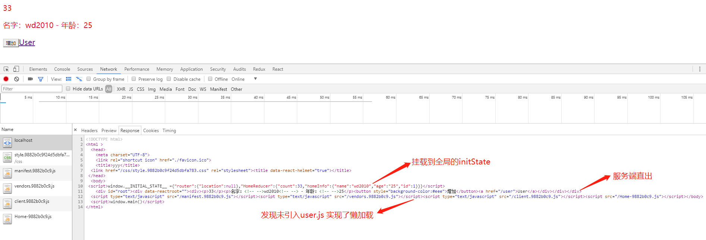

因为对网页SEO的需要，要把之前的React项目改造为服务端渲染，经过一番调查和研究，查阅了大量互联网资料。成功踩坑。
<!-- more -->
<!-- excerpt -->

> 选型思路：实现服务端渲染，想用React最新的版本，并且不对现有的写法做大的改动，如果一开始就打算服务端渲染，建议直接用`NEXT`框架来写

项目地址：[`https://github.com/wlx200510/react_koa_ssr`](https://github.com/wlx200510/react_koa_ssr)
脚手架选型：`webpack3.11.0 + react Router4 + Redux + koa2 + React16 + Node8.x`
主要心得：对`React`的相关知识更加熟悉，成功拓展自己的技术领域，对服务端技术在实际项目上有所积累

*注意点：使用框架前一定确认当前webpack版本为3.x Node为8.x以上，读者最好用React在3个月以上，并有实际React项目经验*

## 项目目录介绍

```
├── assets
│   └── index.css //放置一些全局的资源文件 可以是js 图片等
├── config
│   ├── webpack.config.dev.js  开发环境webpack打包设置
│   └── webpack.config.prod.js 生产环境webpack打包设置
├── package.json
├── README.md
├── server  server端渲染文件，如果对不是很了解，建议参考[koa教程](http://wlxadyl.cn/2018/02/11/koa-learn/)
│   ├── app.js
│   ├── clientRouter.js  // 在此文件中包含了把服务端路由匹配到react路由的逻辑
│   ├── ignore.js
│   └── index.js
└── src
    ├── app  此文件夹下主要用于放置浏览器和服务端通用逻辑
    │   ├── configureStore.js  //redux-thunk设置
    │   ├── createApp.js       //根据渲染环境不同来设置不同的router模式
    │   ├── index.js
    │   └── router
    │       ├── index.js
    │       └── routes.js      //路由配置文件！ 重要
    ├── assets
    │   ├── css                放置一些公共的样式文件
    │   │   ├── _base.scss     //很多项目都会用到的初始化css
    │   │   ├── index.scss
    │   │   └── my.scss
    │   └── img
    ├── components             放置一些公共的组件
    │   ├── FloatDownloadBtn   公共组件样例写法
    │   │   ├── FloatDownloadBtn.js
    │   │   ├── FloatDownloadBtn.scss
    │   │   └── index.js
    │   ├── Loading.js
    │   └── Model.js           函数式组件的写法
    │
    ├── favicon.ico
    ├── index.ejs              //渲染的模板 如果项目需要，可以放一些公共文件进去
    ├── index.js               //包括热更新的逻辑
    ├── pages                  页面组件文件夹
    │   ├── home
    │   │   ├── components     // 用于放置页面组件，主要逻辑
    │   │   │   └── homePage.js
    │   │   ├── containers     // 使用connect来封装出高阶组件 注入全局state数据
    │   │   │   └── homeContainer.js
    │   │   ├── index.js       // 页面路由配置文件 注意thunk属性
    │   │   └── reducer
    │   │       └── index.js   // 页面的reducer 这里暴露出来给store统一处理 注意写法
    │   └── user
    │       ├── components
    │       │   └── userPage.js
    │       ├── containers
    │       │   └── userContainer.js
    │       └── index.js
    └── store
        ├── actions            // 各action存放地
        │   ├── home.js
        │   └── thunk.js
        ├── constants.js       // 各action名称汇集处 防止重名
        └── reducers
            └── index.js       // 引用各页面的所有reducer 在此处统一combine处理
```

## 项目的构建思路

1. 本地开发使用webpack-dev-server，实现热更新，基本流程跟之前react开发类似，仍是浏览器端渲染，因此在编写代码时要考虑到一套逻辑，两种渲染环境的问题。
2. 当前端页面渲染完成后，其Router跳转将不会对服务端进行请求，从而减轻服务端压力，从而页面的进入方式也是两种，还要考虑两种渲染环境下路由同构的问题。
3. 生产环境要使用koa做后端服务器，实现按需加载，在服务端获取数据，并渲染出整个HTML，利用React16最新的能力来合并整个状态树，实现服务端渲染。

### 本地开发介绍

　　查看本地开发主要涉及的文件是`src`目录下的`index.js`文件，判断当前的运行环境，只有在开发环境下才会使用module.hot的API，实现当reducer发生变化时的页面渲染更新通知，注意其中的`hydrate`方法，这是v16版本的一个专门为服务端渲染新增的`API`方法，它在render方法的基础上实现了对服务端渲染内容的最大可能重用，实现了静态`DOM`到动态`NODES`的过程。实质是代替了v15版本下判断checksum标记的过程，使得重用的过程更加高效优雅。

```js
const renderApp=()=>{
  let application=createApp({store,history});
  hydrate(application,document.getElementById('root'));
}
window.main = () => {
  Loadable.preloadReady().then(() => {
    renderApp()
  });
};

if(process.env.NODE_ENV==='development'){
  if(module.hot){
    module.hot.accept('./store/reducers/index.js',()=>{
      let newReducer=require('./store/reducers/index.js');
      store.replaceReducer(newReducer)
    })
    module.hot.accept('./app/index.js',()=>{
      let {createApp}=require('./app/index.js');
      let newReducer=require('./store/reducers/index.js');
      store.replaceReducer(newReducer)
      let application=createApp({store,history});
      hydrate(application,document.getElementById('root'));
    })
  }
}
```

　　注意`window.main`这个函数的定义，结合`index.ejs`可以知道这个函数是所有脚本加载完成后才触发，里面用的是`react-loadable`的写法，用于页面的懒加载，关于页面分别打包的写法要结合路由设置来讲解，这里有个大致印象即可。需要注意的是app这个文件下暴露出的三个方法是在浏览器端和服务器端通用的，接下来主要就是说这部分的思路。

### 路由处理

　　接下来看以下`src/app`目录下的文件，`index.js`暴露了三个方法，这里面涉及的三个方法在服务端和浏览器端开发都会用到，这一部分主要讲其下的`router`文件里面的代码思路和`createApp.js`文件对路由的处理，这里是实现两端路由相互打通的关键点。
　　`router`文件夹下的routes.js是路由配置文件，将各个页面下的路由配置都引进来，合成一个配置数组，可以通过这个配置来灵活控制页面上下线。同目录下的`index.js`是`RouterV4`的标准写法，通过遍历配置数组的方式传入路由配置，`ConnectRouter`是用于合并`Router`的一个组件，注意到`history`要作为参数传入，需要在`createApp.js`文件里做单独的处理。先大致看一下Route组件中的几个配置项，值得注意的是其中的`thunk`属性，这是实现后端获取数据后渲染的关键一步，正是这个属性实现了类似`Next`里面的组件提前获取数据的生命周期钩子，其余的属性都可以在相关[React-router文档](https://reacttraining.com/react-router/web/api/Route)中找到说明，这里不在赘述。

```js
import routesConfig from './routes';
const Routers=({history})=>(
  <ConnectedRouter history={history}>
    <div>
      {
        routesConfig.map(route=>(
          <Route key={route.path} exact={route.exact} path={route.path} component={route.component}  thunk={route.thunk}  />
        ))
      }
    </div>
  </ConnectedRouter>
)
export default Routers;
```

　　查看`app`目录下的`createApp.js`里面的代码可以发现，本框架是针对不同的工作环境做了不同的处理，只有在生产环境下才利用Loadable.Capture方法实现了懒加载，动态引入不同页面对应的打包之后的js文件。到这里还要看一下组件里面的路由配置文件的写法，以`home`页面下的`index.js`为例。注意`/* webpackChunkName: 'Home' */`这串字符，实质是指定了打包后此页面对应的js文件名，所以针对不同的页面，这个注释也需要修改，避免打包到一起。`loading`这个配置项只会在开发环境生效，当页面加载未完成前显示，这个实际项目开发如果不需要可以删除此组件。

```js
import {homeThunk} from '../../store/actions/thunk';

const LoadableHome = Loadable({
    loader: () =>import(/* webpackChunkName: 'Home' */'./containers/homeContainer.js'),
    loading: Loading,
});

const HomeRouter = {
    path: '/',
    exact: true,
    component: LoadableHome,
    thunk: homeThunk // 服务端渲染会开启并执行这个action，用于获取页面渲染所需数据
}
export default HomeRouter
```

　　这里多说一句，有时我们要改造的项目的页面文件里有从`window.location`里面获取参数的代码，改造成服务端渲染时要全部去掉，或者是要在render之后的生命周期中使用。并且页面级别组件都已经注入了相关路由信息，可以通过`this.props.location`来获取URL里面的参数。本项目用的是`BrowserRouter`，如果用`HashRouter`则包含参数可能略有不同，根据实际情况取用。

根据React16的服务端渲染的API介绍：
　　浏览器端使用的注入`ConnectedRouter`中的`history`为：`import createHistory from 'history/createBrowserHistory'`
　　服务器端使用的`history`为`import createHistory from 'history/createMemoryHistory'`


### 服务端渲染

　　这里就不会涉及到`koa2`的一些基础知识，如果对`koa2`框架不熟悉可以参考我的另外一篇[博文](http://wlxadyl.cn/2018/02/11/koa-learn/)。这里是看server文件夹下都是服务端的代码。首先是简洁的`app.js`用于保证每次连接都返回的是一个新的服务器端实例，这对于单线程的js语言是很关键的思路。需要重点介绍的就是`clientRouter.js`这个文件，结合`/src/app/configureStore.js`这个文件共同理解服务端渲染的数据获取流程和React的渲染机制。

```js
/*configureStore.js*/
import {createStore, applyMiddleware,compose} from "redux";
import thunkMiddleware from "redux-thunk";
import createHistory from 'history/createMemoryHistory';
import {  routerReducer, routerMiddleware } from 'react-router-redux'
import rootReducer from '../store/reducers/index.js';

const routerReducers=routerMiddleware(createHistory());//路由
const composeEnhancers = process.env.NODE_ENV=='development'?window.__REDUX_DEVTOOLS_EXTENSION_COMPOSE__ : compose;

const middleware=[thunkMiddleware,routerReducers]; //把路由注入到reducer，可以从reducer中直接获取路由信息

let configureStore=(initialState)=>createStore(rootReducer,initialState,composeEnhancers(applyMiddleware(...middleware)));

export default configureStore;
```
　　`window.__REDUX_DEVTOOLS_EXTENSION_COMPOSE__`这个变量是浏览器里面的Redux的开发者工具，开发React-redux应用时建议安装，否则会有报错提示。这里面大部分都是`redux-thunk`的示例代码，关于这部分如果看不懂建议看一下`redux-thunk`的官方文档，这里要注意的是`configureStore`这个方法要传入的`initialState`参数，这个渲染的具体思路是：在服务端判断路由的thunk方法，如果存在则需要执行这个获取数据逻辑，这是个阻塞过程，可以当作同步，获取后放到全局State中，在前端输出的HTML中注入`window.__INITIAL_STATE__`这个全局变量，当html载入完毕后，这个变量赋值已有数据的全局`State`作为`initState`提供给react应用，然后浏览器端的js加载完毕后会通过复用页面上已有的dom和初始的`initState`作为开始，合并到render后的生命周期中，从而在`componentDidMount`中已经可以从this.props中获取渲染所需数据。
　　但还要考虑到页面切换也有可能在前端执行跳转，此时作为React的应用不会触发对后端的请求，因此在`componentDidMount`这个生命周期里并没有获取数据，为了解决这个问题，我建议在这个生命周期中都调用props中传来的`action`触发函数，但在action内部进行一层逻辑判断，避免重复的请求，实际项目中请求数据往往会有个标识性ID，就可以将这个ID存入`store`中，然后就可以进行一次对比校验来提前返回，避免重复发送`ajax`请求，具体可看store/actions/home.js`中的逻辑处理。

```javascript
import {ADD,GET_HOME_INFO} from '../constants'
export const add=(count)=>({type: ADD, count,})

export const getHomeInfo=(sendId=1)=>async(dispatch,getState)=>{
  let {name,age,id}=getState().HomeReducer.homeInfo;
  if (id === sendId) {
    return //是通过对请求id和已有数据的标识性id进行对比校验，避免重复获取数据。
  }
  console.log('footer'.includes('foo'))
  await new Promise(resolve=>{
    let homeInfo={name:'wd2010',age:'25',id:sendId}
    console.log('-----------请求getHomeInfo')
    setTimeout(()=>resolve(homeInfo),1000)
  }).then(homeInfo=>{
    dispatch({type:GET_HOME_INFO,data:{homeInfo}})
  })
}
```

　　注意这里的`async/await`写法，这里涉及到服务端koa2使用这个来做数据请求，因此需要统一返回`async`函数，这块不熟的同学建议看下ES7的知识，主要是`async`如何配合`Promise`实现异步流程改造，并且如果涉及koa2的服务端工作，对`async`函数用的更多，这也是本项目要求Node版本为8.x以上的原因，从8开始就可以直接用这两个关键字。
　　不过到具体项目中，往往会涉及到一些服务端参数的注入问题，但这块根据不同项目需求差异很大，并且不属于这个React服务端改造的一部分，没法统一分享，如果真是公司项目要用到对这块有需求咨询可以打赏后加我微信讨论。

### 以Home页面为例的渲染流程

为了方便大家理解，我以一个页面为例整理了一下数据流的整体过程，看一下思路：
1. 服务端接收到请求，通过`/home`找到对应的路由配置
2. 判断路由存在`thunk`方法，此时执行`store/actions/thunk.js`里面的暴露出的函数
3. 异步获取的数据会注入到全局state中，此时的dispatch分发其实并不生效
4. 要输出的HTML代码中会将获取到数据后的全局state放到`window.__INITIAL_STATE__`这个全局变量中，作为initState
5. `window.__INITIAL_STATE__`将在react生命周期起作用前合并入全局state，此时react发现dom已经生成，不会再次触发render，并且数据状态得到同步



　　基本的流程已经介绍结束，至于一些`Reducer`的函数式写法，还有actions的位置都是参考网上的一些分析来组织的，具体见仁见智，这个只要符合自己的理解，并且有助于团队开发就好。如果您符合我在文章一开始设定的读者背景，相信本文的讲述足够您点亮自己的服务端渲染技术点啦。如果对React了解偏少也没关系，可以参考[这里](https://github.com/wlx200510/react-wlx)来补充一些React的基础知识，也可以到[我的博客](http://wlxadyl.cn/)学习交流。

<b>如果这篇文章对您有帮助，或者用于您公司的项目发现一些问题，欢迎加我微信打赏后讨论并解决问题~。</b>

打赏二维码：


打赏获取特权流程：
- 扫描下发二维码 加我为好友
- 发送打赏截图给我
- 拉你进React的服务端渲染讨论微信群
- 解答这个框架在实际应用中的问题

